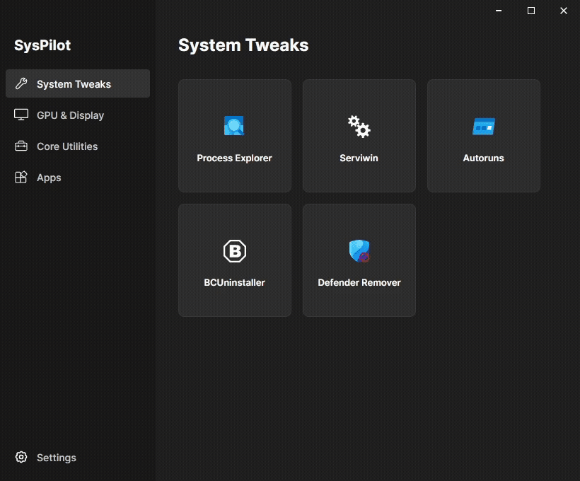

# ✈️ SysPilot

**SysPilot** is an advanced, all-in-one system management, tweaking, and deployment hub designed for power users and IT professionals. Built with C# and Avalonia UI, SysPilot provides a seamless, unified interface to download, launch, and update essential applications, core utilities, and powerful system configuration tools. 

---

> [!WARNING]
> ### ⚠️ DANGER: PROCEED WITH CAUTION
> **This program includes highly powerful system tweaking tools (e.g., Serviwin, Autoruns, DefenderRemover, DDU).** 
> If used incorrectly, these tools can irreversibly corrupt your Windows installation, cause boot failures, network loss, or effectively **brick your operating system**. 
> - **Do NOT** use the System Tweaks or GPU tools unless you know exactly what they do.
> - Always create a System Restore point or full backup before executing advanced utilities.
> - The developers of SysPilot assume zero liability for any system damage caused by the misuse of the included software.

---

## 🎥 App Showcase

  

---

## 📖 What is SysPilot?

SysPilot serves as your automated co-pilot for setting up a fresh Windows installation or maintaining a complex desktop environment. Instead of manually navigating the web to download your web browsers, GPU driver cleaners, or system diagnostic tools, SysPilot handles everything via a highly optimized, automated backend (`AppDownloadService` & `AppLaunchService`).

### 🚀 Key Features

*   **Centralized App Catalog**: Uses a scalable `catalog.json` architecture to map, download, and manage software directly from trusted sources.
*   **Velopack Integration**: Fully automated continuous deployment and application updates using Velopack, ensuring you are always running the latest version of SysPilot.
*   **Automated Unattended Setups**: Skip the bloat and install what you need instantly. 
*   **Modern MVVM Architecture**: Built entirely on C# utilizing Avalonia UI for a blazing fast, fluid user experience.

---

## 🧰 The Arsenal: Included Tools & Categories

SysPilot organizes its massive software catalog into distinct, easy-to-navigate categories. 

### 1. System Tweaks (Power User Utilities)
*Proceed with extreme caution.*
*   **Autoruns**: Manage auto-starting programs, boot execute images, and shell extensions. 
*   **BCUninstaller**: Bulk Crap Uninstaller for completely removing stubborn software and leftover registry keys.
*   **DefenderRemover**: A script-based tool to completely rip Windows Defender out of the OS. *(High risk of breaking Windows Update or OS stability)*.
*   **Process Explorer**: Advanced task management showing detailed process trees, DLLs, and handle usage.
*   **Serviwin**: Displays the list of installed drivers and services, allowing you to easily stop, start, restart, or change their startup types.

### 2. GPU & Display Utilities
*   **DDU (Display Driver Uninstaller)**: The industry standard for completely wiping AMD/NVIDIA/Intel graphics drivers from the registry and driver store.
*   **NVCleanstall**: Customize the NVIDIA GeForce driver installation by removing telemetry and unneeded components.
*   **Radeon Slimmer**: Strip down AMD Radeon driver packages to only the essentials.
*   **CRU (Custom Resolution Utility)**: Define custom resolutions and refresh rates directly in the EDID of your monitor.
*   **MSI Afterburner**: The gold standard for GPU overclocking, undervolting, and hardware monitoring.

### 3. Everyday Apps & Media
Instantly provision your machine with daily drivers:
*   **Browsers**: Firefox, LibreWolf
*   **Media**: VLC Media Player, Spotify, qView (ultra-lightweight image viewer)
*   **Productivity**: LibreOffice
*   **Gaming**: Steam, Epic Games, Discord

### 4. Core Utilities
Essential runtimes and file managers:
*   **.NET & DirectX Runtimes**
*   **7-Zip**
*   **Visual Studio 2026**

---

### System Internals
*   **`Services/`**: The brain of SysPilot. Contains critical logic like `AppDownloadService.cs` for fetching binaries, `AppLaunchService.cs` for execution handling, and `CatalogService.cs` for parsing the JSON software database.
*   **`Models/`**: Defines the data structures (`AppItem`, `CatalogData`) bridging the UI and the backend.
*   **`Converters/`**: Includes `SvgAssetValueConverter.cs` to dynamically render vector graphics for the UI interface.
*   **CI/CD Pipeline**: Relies on GitHub Actions (`.github/workflows/release.yml`) and `vpk` (Velopack) to package self-contained `win-x64` binaries on Git tag pushes.

---

## ⚙️ Installation & Usage

1. Go to the [Releases](https://github.com/matheus-404/SysPilot/releases) page.
2. Download the latest `SysPilot-Setup.exe` (packaged via Velopack).
3. Run the application (Administrative privileges may be requested for core tweaking tools).
4. Navigate the sidebar categories (System Tweaks, GPU & Display, Core Utilities, Apps) to install or launch your desired applications.

---

## 📄 License

This project is licensed under the GNU General Public License v3.0 - see the [LICENSE.txt](LICENSE.txt) file for details.
